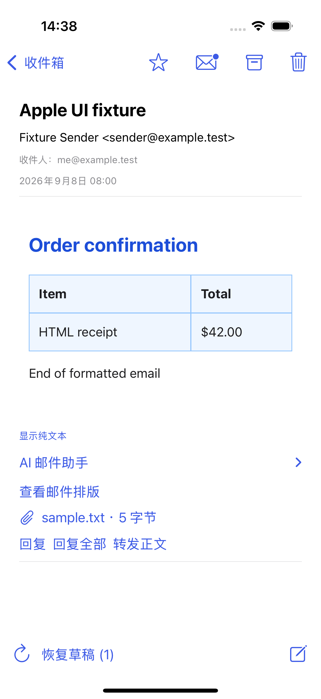
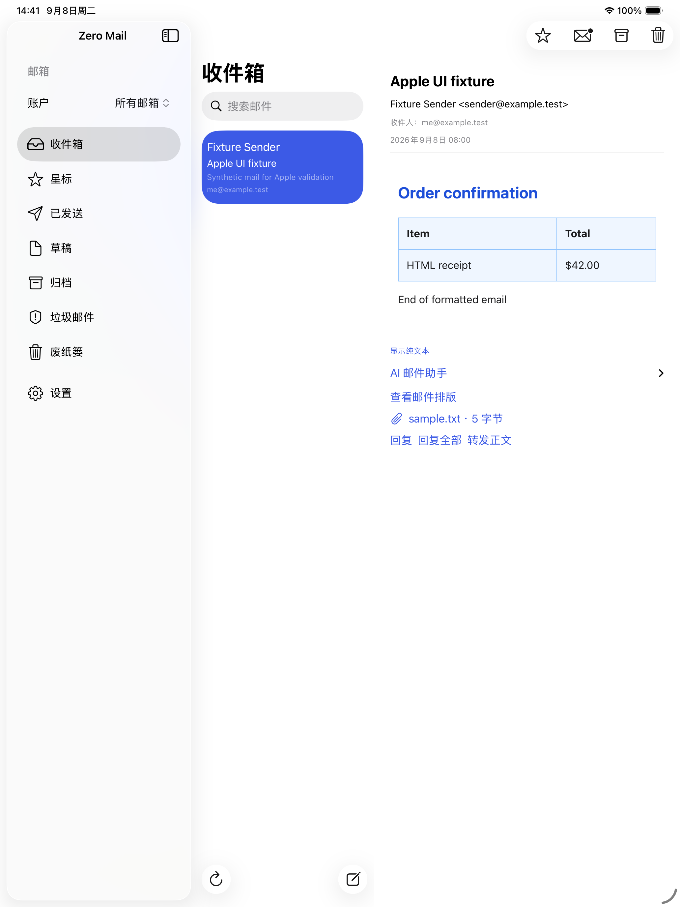

# Zero Mail for Apple platforms

Native mailbox reading now renders styled HTML inline on iPhone, iPad and Mac while keeping text-only fallback and isolated WebKit security controls.

<p align="center">
  
  &nbsp;&nbsp;
  
</p>

Native SwiftUI applications share the `ZeroPairing` authentication library and the `ZeroMail` mail library. Open **ZeroMail.xcodeproj** in Xcode 16 or later:

| Scheme    | Platform                                           | Minimum OS      |
| --------- | -------------------------------------------------- | --------------- |
| ZeroMac   | Native macOS, SwiftUI + AppKit/WebKit              | macOS 13        |
| ZeroIOS   | Universal iPhone and iPad application              | iOS / iPadOS 16 |
| ZeroWatch | Independent, single-target Apple Watch application | watchOS 9       |

**[开发与设备验收说明](MIGRATION.zh-CN.md)** · **[2026-09-08 验证记录](VALIDATION.zh-CN.md)**

The checked-in project includes application targets and shared schemes. No project generator or third-party Swift dependencies are needed to open or build it. `scripts/generate-project.rb` is only for deliberate project regeneration; it uses `xcodeproj` 1.27.0 and overwrites project settings.

Implemented source includes device pairing and management, mailbox selection, search and pagination, AI category filtering and correction, thread reading, read/star/archive/trash actions, composing/replying, mailbox drafts, attachments, Handoff routing, `mailto:` / `zeromail:` links, and an App Intent that opens the composer for review. Watch has a separate compact reading and reply UI. AI reading and writing reuse the server's configured provider; generated text requires review before sending. Server account and model setup remain in the existing web settings.

Credentials stay in device-only Keychain entries, isolated by server origin. Each device pairs separately; Handoff carries no credentials or message body. Release builds require HTTPS. Debug builds also accept exact loopback HTTP origins, including `http://localhost:18080`, for development. Redirects, cookies and URL caching remain disabled. Unsaved drafts use encrypted, device-only crash recovery; exported attachments and pending system shares use protected files. HTML mail renders inline on macOS, iOS and iPadOS, with native text for text-only messages and an optional plain-text view. The isolated HTML renderer blocks scripts, remote resources, navigation and form submissions. See [HTML rendering](HTML-RENDERING.zh-CN.md).

Apple integrations include opt-in event-based local notifications, iOS/iPadOS incoming share extensions, WidgetKit widgets and Watch complications, and application icon assets. See [notifications](NOTIFICATIONS.zh-CN.md), [extensions and App Group signing](EXTENSIONS.zh-CN.md), and [draft recovery](DRAFT-RECOVERY.md). Notifications require the new server `events` API and a running application; APNs background delivery is not implemented.

AI also supports existing Docker deployments whose web AI works but which lack the newer native AI adapter: after detecting a missing native status endpoint, the client uses the existing authenticated web AI procedures on the same Zero server. Model requests and credentials remain server-side. See [AI compatibility fix](AI-COMPATIBILITY.zh-CN.md).

Settings follow Apple Mail conventions: macOS has a separate Settings window with General, Accounts, Classification, Viewing, Notifications and Devices tabs; iPhone, iPad and Watch expose the same owner-scoped classification progress and resource limits in their in-app settings. The limits are stored on the server and therefore stay consistent with the web UI and every paired Apple device. iPhone and iPad also expose list, reading and notification preferences in the system Settings app through `Settings.bundle`; those changes apply when returning to the running app. Pairing and account management remain in-app. See [Apple settings](SETTINGS.zh-CN.md).

The native API is `POST /api/native/v1/{operation}` with the opaque signed bearer returned by pairing. It delegates ownership checks and provider operations to the existing unified mailbox routers. It does not implement a second IMAP client or copy mailbox passwords to Apple devices. See [API.md](API.md).

On macOS:

```sh
cd native/apple
bash scripts/validate-macos.sh
open ZeroMail.xcodeproj
```

The September 8 validation uses macOS and Xcode, Apple simulator UI tests, real Keychain tests and an isolated Nginx/Worker/PostgreSQL integration stack. See the validation record for exact results and evidence. Simulator or unsigned builds do not establish App Group provisioning, physical-device Handoff, APNs, TestFlight or notarization readiness. The GitHub workflow has been updated but has not been dispatched in this workspace.

The existing Electron Windows client and experimental Capacitor shell remain available. Apple development should continue in this directory.

Authentication and recovery: [deployment guide](../../deploy/AUTHENTICATION.zh-CN.md). Apple references: [SwiftUI navigation across platforms](https://developer.apple.com/documentation/technotes/tn3154-adopting-swiftui-navigation-split-view), [independent watchOS applications](https://developer.apple.com/documentation/watchos-apps/creating-independent-watchos-apps), [Handoff](https://developer.apple.com/documentation/foundation/implementing-handoff-in-your-app).
